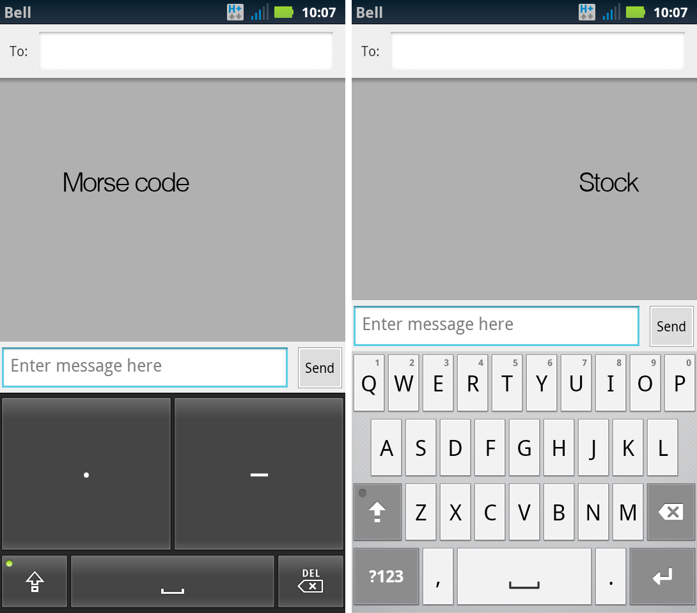

Morse code IME
==============

The [Morse code] input method editor is a soft keyboard for Android phones that replaces the default stock keyboard with one that only has two buttons - a dot and a dash. Many thanks to Google for sharing this great idea as [Gmail Tap] on April Fool's day 2012. **This is a rough implementation of this idea.**

  [Morse code]:https://en.wikipedia.org/wiki/Morse_code
  [Gmail Tap]:https://www.youtube.com/watch?v=1KhZKNZO8mQ

> You can tap it in the morning,  
> You can tap it at night,  
> You can tap in the bathroom,  
> It's a dot and a dash to have a conversation with the whole world.  
> -- Todd Smith, Gmail Tap Product Lead

This is very cool because, as mentioned in the Gmail Tap video, people with larger fingers can now type quickly without error.

(Tested only on a Motorola Atrix.)

International Morse code
------------------------

|Character|Code|Character|Code|
|:-------:|:--:|:-------:|:--:|
|A|**&middot;&nbsp;-**|N|**--&nbsp;&middot;**|
|B|**--&nbsp;&middot;&nbsp;&middot;&nbsp;&middot;&nbsp;**|O|**--&nbsp;--&nbsp;--**|
|C|**--&nbsp;&middot;&nbsp;--&nbsp;&middot;&nbsp;**|P|**&nbsp;&middot;&nbsp;--&nbsp;--&nbsp;&middot;**|
|D|**--&nbsp;&middot;&nbsp;&middot;&nbsp;**|Q|**--&nbsp;--&nbsp;&middot;&nbsp;--**|
|E|**&middot;&nbsp;**|R|**&nbsp;&middot;&nbsp;--&nbsp;&middot;**|
|F|**&middot;&nbsp;&middot;&nbsp;--&nbsp;&middot;&nbsp;**|S|**&nbsp;&middot;&nbsp;&middot;&nbsp;&middot;**|
|G|**--&nbsp;--&nbsp;&middot;&nbsp;**|T|**--**|
|H|**&nbsp;&middot;&nbsp;&middot;&nbsp;&middot;&nbsp;&middot;**|U|**&nbsp;&middot;&nbsp;&middot;&nbsp;--**|
|I|**&nbsp;&middot;&nbsp;&middot;**|V|**&nbsp;&middot;&nbsp;&middot;&nbsp;&middot;&nbsp;--**|
|J|**&nbsp;&middot;&nbsp;--&nbsp;--&nbsp;**|W|**&nbsp;&middot;&nbsp;--&nbsp;--**|
|K|**--&nbsp;&middot;&nbsp;--**|X|**--&nbsp;&middot;&nbsp;&middot;&nbsp;--**|
|L|**&nbsp;&middot;&nbsp;--&nbsp;&middot;&nbsp;&middot;**|Y|**--&nbsp;&middot;&nbsp;--&nbsp;--**|
|M|**--&nbsp;--**|Z|**--&nbsp;--&nbsp;&middot;&nbsp;&middot;**|

Extra codes for digits and common punctuation

|Character|Code|Character|Code|
|:-------:|:--:|:-------:|:--:|
|1|**&nbsp;&middot;&nbsp;--&nbsp;--&nbsp;--&nbsp;--**|.|**&nbsp;&middot;&nbsp;--&nbsp;&middot;&nbsp;--&nbsp;&middot;&nbsp;--**|
|2|**&nbsp;&middot;&nbsp;&middot;&nbsp;--&nbsp;--&nbsp;--**|,|**&nbsp;--&nbsp;--&nbsp;&middot;&nbsp;&middot;&nbsp;--&nbsp;--**|
|3|**&nbsp;&middot;&nbsp;&middot;&nbsp;&middot;&nbsp;--&nbsp;--**|?|**&nbsp;&middot;&nbsp;&middot;&nbsp;--&nbsp;--&nbsp;&middot;&nbsp;&middot;**|
|4|**&nbsp;&middot;&nbsp;&middot;&nbsp;&middot;&nbsp;&middot;&nbsp;--**|'|**&nbsp;&middot;&nbsp;--&nbsp;--&nbsp;--&nbsp;--&nbsp;&middot;**|
|5|**&nbsp;&middot;&nbsp;&middot;&nbsp;&middot;&nbsp;&middot;&nbsp;&middot;**|!|**&nbsp;--&nbsp;&middot;&nbsp;--&nbsp;&middot;&nbsp;--&nbsp;--**|
|6|**&nbsp;--&nbsp;&middot;&nbsp;&middot;&nbsp;&middot;&nbsp;&middot;**|/|**&nbsp;--&nbsp;&middot;&nbsp;&middot;&nbsp;--&nbsp;&middot;**|
|7|**&nbsp;--&nbsp;--&nbsp;&middot;&nbsp;&middot;&nbsp;&middot;**|(|**&nbsp;--&nbsp;&middot;&nbsp;--&nbsp;--&nbsp;&middot;**|
|8|**&nbsp;--&nbsp;--&nbsp;--&nbsp;&middot;&nbsp;&middot;**|)|**&nbsp;--&nbsp;&middot;&nbsp;--&nbsp;--&nbsp;&middot;&nbsp;--**|
|9|**&nbsp;--&nbsp;--&nbsp;--&nbsp;--&nbsp;&middot;**|&amp;|**&nbsp;&middot;&nbsp;--&nbsp;&middot;&nbsp;&middot;&nbsp;&middot;**|
|0|**&nbsp;--&nbsp;--&nbsp;--&nbsp;--&nbsp;--**|:|**&nbsp;--&nbsp;--&nbsp;--&nbsp;&middot;&nbsp;&middot;&nbsp;&middot;**|
|;|**&nbsp;--&nbsp;&middot;&nbsp;--&nbsp;&middot;&nbsp;--**|-|**&nbsp;--&nbsp;&middot;&nbsp;&middot;&nbsp;&middot;&nbsp;&middot;&nbsp;--**|
|_|**&nbsp;&middot;&nbsp;&middot;&nbsp;--&nbsp;--&nbsp;&middot;&nbsp;--**|\\|**&nbsp;&middot;&nbsp;--&nbsp;&middot;&nbsp;&middot;&nbsp;--&nbsp;&middot;**|
|$|**&nbsp;&middot;&nbsp;&middot;&nbsp;&middot;&nbsp;--&nbsp;&middot;&nbsp;&middot;&nbsp;--**|@|**&nbsp;&middot;&nbsp;--&nbsp;--&nbsp;&middot;&nbsp;--&nbsp;&middot;**|

And two [procedural signals](https://en.wikipedia.org/wiki/Prosigns_for_Morse_code)

|Code|Meaning|Code|Meaning|
|:--:|:-----:|:--:|:-----:|
|**&nbsp;&middot;&nbsp;--&nbsp;&middot;&nbsp;--**|Newline|**&nbsp;&middot;&nbsp;--&nbsp;&middot;&nbsp;--&nbsp;&middot;**|End-of-transmisson (EOT)|

Building and installing
-----------------------

To build from source, Ant, the JDK, and the Android SDK are all required.

1. `android update project -p .` to create the local properties file.
2. Run `ant debug` to create the package.
3. `adb -d install ./bin/MorseCodeKeyboard-debug.apk`

Once the `.apk` file has been installed, open *Settings > Language and Keyboard* on the device. Select the checkbox beside *Morse code* and accept the warning. Select the *Input Method* preference option and choose *Morse code* to change to the new keyboard. All done.

The delete key behaviour
------------------------

The delete key behaviour may seem a bit weird at first. What it does is this: if you enter a sequence of dots and dashes and then press delete, it will empty the composing text (as in the dots/dashes), not just the last character. **It deletes the whole sequence that was entered, not just the last dot/dash.** In the event that no sequence was entered and the delete key is pressed, it will then delete the previous character. This should become intuitive after a bit of use.

TODO
----

- Holo-style UI update
- Accelerating delete
- Blind tapping implementation
- Haptic feedback and/or position one key above the other
